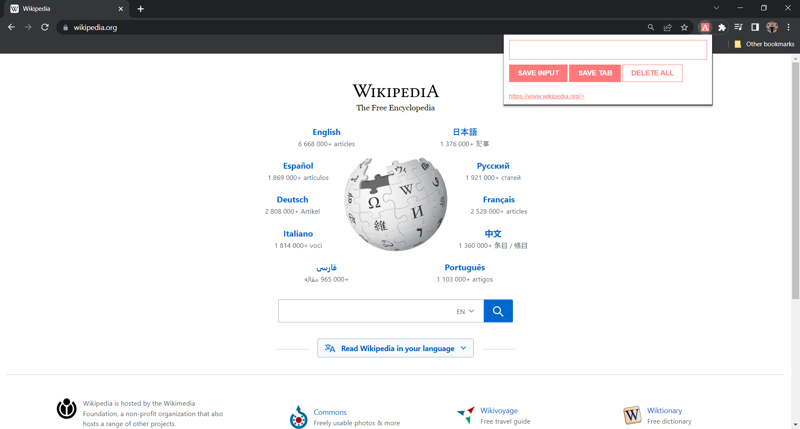
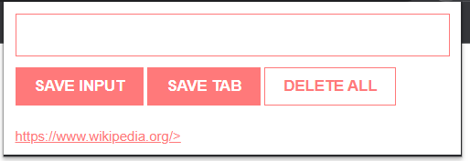

## Personal Archive: Effortlessly Save and Organize Your Online Discoveries with our Chrome Extension

Introducing Personal Archive, a powerful Chrome extension designed to make saving and organizing your online discoveries a breeze. With a simple click, you can instantly capture and store webpages, articles, and resources that are important to you. Our intuitive interface seamlessly integrates with your Chrome browser, allowing you to create custom folders, add tags, and annotate your saved URLs for easy retrieval.

### This is how it looks like when you open

### A closer look of chrome this chrome extension

